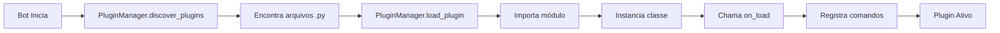

# 🔌 Guia Completo: Criando Plugins para o Bot

Guia detalhado para desenvolver seus próprios plugins e estender as funcionalidades do bot de música.

---

## 📋 Índice

1. [Introdução](#-introdução)
2. [Arquitetura do Sistema](#-arquitetura-do-sistema)
3. [Criando seu Primeiro Plugin](#-criando-seu-primeiro-plugin)
4. [Estrutura de um Plugin](#-estrutura-de-um-plugin)
5. [Tipos de Comandos](#-tipos-de-comandos)
6. [Hooks de Eventos](#-hooks-de-eventos)
7. [Configuração de Plugins](#-configuração-de-plugins)
8. [Exemplos Avançados](#-exemplos-avançados)
9. [Boas Práticas](#-boas-práticas)
10. [Troubleshooting](#-troubleshooting)

---

## 🎯 Introdução

O sistema de plugins permite que você:

- ✅ **Adicione novos comandos** sem modificar o código principal
- ✅ **Estenda funcionalidades** de forma modular
- ✅ **Hot reload** - recarregue plugins sem reiniciar o bot
- ✅ **Isolamento** - plugins não interferem uns com os outros
- ✅ **Compartilhamento** - distribua seus plugins facilmente

### Quando Criar um Plugin?

**✅ Crie um plugin quando:**
- Quiser adicionar uma funcionalidade específica
- A feature pode ser opcional/desabilitável
- Deseja compartilhar a funcionalidade com outros
- Quer experimentar sem modificar o core

**❌ Não crie um plugin quando:**
- A funcionalidade é crítica para o bot funcionar
- Precisa modificar comportamento fundamental
- Depende fortemente do código principal

---

## 🏗️ Arquitetura do Sistema

### Componentes Principais

```
plugins/
├── __init__.py                 # Inicialização do módulo
├── plugin_base.py              # Classe base (PluginBase)
├── plugin_manager.py           # Gerenciador (PluginManager)
├── example_hello.py            # Exemplo de plugin
└── seu_plugin.py               # Seu plugin aqui!
```

### Fluxo de Carregamento



### Ciclo de Vida

```python
1. Descoberta    → discover_plugins()
2. Carregamento  → load_plugin() → on_load()
3. Habilitação   → on_enable()
4. Execução      → get_commands(), hooks
5. Desabilitação → on_disable()
6. Descarregamento → on_unload()
```

---

## 🚀 Criando seu Primeiro Plugin

### Passo 1: Criar o Arquivo

Crie `plugins/meu_plugin.py`:

```python
"""
Meu Primeiro Plugin
Descrição do que o plugin faz
"""

import discord
from discord.ext import commands
from plugins.plugin_base import PluginBase


class MeuPlugin(PluginBase):
    """Descrição da classe do plugin"""

    @property
    def name(self) -> str:
        return "Meu Plugin"

    @property
    def version(self) -> str:
        return "1.0.0"

    @property
    def description(self) -> str:
        return "Meu primeiro plugin de exemplo"

    @property
    def author(self) -> str:
        return "Seu Nome"

    async def on_load(self) -> bool:
        """Inicialização do plugin"""
        print(f"✅ {self.name} carregado!")
        return True

    def get_commands(self) -> list:
        """Retorna lista de comandos"""

        @commands.command(name="oi")
        async def oi_command(ctx):
            await ctx.send(f"Olá {ctx.author.mention}! Plugin funcionando! 👋")

        return [oi_command]
```

### Passo 2: Testar o Plugin

```python
# No bot ou através de comando
!plugin load meu_plugin
!oi  # Testa o comando
```

### Passo 3: Ver Status

```python
!plugin list     # Lista plugins carregados
!plugin info meu_plugin  # Informações detalhadas
```

---

## 📦 Estrutura de um Plugin

### Classe Base: `PluginBase`

Todos os plugins **devem** herdar de `PluginBase`:

```python
from plugins.plugin_base import PluginBase

class MeuPlugin(PluginBase):
    pass
```

### Propriedades Obrigatórias

```python
@property
def name(self) -> str:
    """Nome do plugin (obrigatório)"""
    return "Nome do Plugin"

@property
def version(self) -> str:
    """Versão no formato X.Y.Z (obrigatório)"""
    return "1.0.0"

@property
def description(self) -> str:
    """Descrição do que o plugin faz (obrigatório)"""
    return "Este plugin faz X, Y e Z"
```

### Propriedades Opcionais

```python
@property
def author(self) -> str:
    """Autor do plugin (opcional)"""
    return "Seu Nome"

@property
def dependencies(self) -> list:
    """Lista de dependências (opcional)"""
    return ["requests", "aiohttp"]
```

### Métodos do Ciclo de Vida

```python
async def on_load(self) -> bool:
    """
    Chamado quando o plugin é carregado
    Use para inicialização, carregar configs, etc.

    Returns:
        True = sucesso, False = falha (plugin não será carregado)
    """
    # Inicializar recursos
    self.data = {}
    return True

async def on_unload(self) -> bool:
    """
    Chamado quando o plugin é descarregado
    Use para limpeza, salvar dados, fechar conexões

    Returns:
        True = sucesso, False = falha
    """
    # Limpar recursos
    self.data.clear()
    return True

async def on_enable(self) -> bool:
    """Chamado quando o plugin é habilitado"""
    self.enabled = True
    return True

async def on_disable(self) -> bool:
    """Chamado quando o plugin é desabilitado"""
    self.enabled = False
    return True
```

---

## 🎮 Tipos de Comandos

### 1. Comandos de Prefixo (Prefix Commands)

Comandos tradicionais com prefixo (`!comando`):

```python
def get_commands(self) -> list:
    @commands.command(
        name="ping",
        aliases=["p", "latency"],
        help="Mostra a latência do bot"
    )
    async def ping(ctx: commands.Context):
        latency = round(self.bot.latency * 1000)
        await ctx.send(f"🏓 Pong! Latência: {latency}ms")

    return [ping]
```

**Recursos:**
- `name`: Nome do comando
- `aliases`: Nomes alternativos
- `help`: Descrição (aparece em `!help`)
- `brief`: Descrição curta
- `usage`: Como usar o comando
- `enabled`: Se está habilitado

### 2. Comandos Slash (Slash Commands)

Comandos modernos do Discord (`/comando`):

```python
from discord import app_commands

def get_commands(self) -> list:
    @app_commands.command(
        name="stats",
        description="Mostra estatísticas do servidor"
    )
    @app_commands.describe(
        tipo="Tipo de estatística (membros, canais, roles)"
    )
    async def stats(
        interaction: discord.Interaction,
        tipo: str = "membros"
    ):
        if tipo == "membros":
            count = len(interaction.guild.members)
            await interaction.response.send_message(
                f"📊 Total de membros: {count}"
            )

    return [stats]
```

**Recursos:**
- Autocomplete nativo do Discord
- Parâmetros tipados
- Descrições integradas
- Validação automática

### 3. Comandos com Argumentos

```python
@commands.command(name="somar")
async def somar(ctx, num1: int, num2: int):
    """Soma dois números"""
    resultado = num1 + num2
    await ctx.send(f"🧮 {num1} + {num2} = {resultado}")
```

### 4. Comandos com Escolhas (Slash)

```python
from typing import Literal

@app_commands.command(name="idioma")
@app_commands.describe(lang="Escolha o idioma")
async def idioma(
    interaction: discord.Interaction,
    lang: Literal["pt-BR", "en-US", "es-ES"]
):
    await interaction.response.send_message(f"Idioma definido: {lang}")
```

### 5. Comandos Híbridos

Funcionam com prefixo E slash:

```python
from discord.ext.commands import hybrid_command

@hybrid_command(name="info")
async def info(ctx: commands.Context):
    """Funciona com !info e /info"""
    await ctx.send("ℹ️ Informações do bot")
```

---

## 🎣 Hooks de Eventos

Plugins podem reagir a eventos do Discord:

### 1. Mensagens

```python
async def on_message(self, message: discord.Message) -> None:
    """Chamado quando qualquer mensagem é enviada"""

    # Ignorar bots
    if message.author.bot:
        return

    # Detectar palavras proibidas
    if "spam" in message.content.lower():
        await message.delete()
        await message.channel.send(
            f"{message.author.mention}, spam não é permitido!"
        )
```

### 2. Reações

```python
async def on_reaction_add(
    self,
    reaction: discord.Reaction,
    user: discord.User
) -> None:
    """Chamado quando uma reação é adicionada"""

    # Sistema de votação
    if reaction.emoji == "⭐" and reaction.count >= 5:
        await reaction.message.channel.send(
            f"🌟 Mensagem popular! {reaction.count} estrelas!"
        )
```

### 3. Estado de Voz

```python
async def on_voice_state_update(
    self,
    member: discord.Member,
    before: discord.VoiceState,
    after: discord.VoiceState
) -> None:
    """Chamado quando alguém entra/sai/muda de canal de voz"""

    # Entrou em um canal
    if before.channel is None and after.channel is not None:
        print(f"✅ {member.name} entrou em {after.channel.name}")

    # Saiu de um canal
    elif before.channel is not None and after.channel is None:
        print(f"❌ {member.name} saiu de {before.channel.name}")

    # Mudou de canal
    elif before.channel != after.channel:
        print(f"🔄 {member.name} mudou de canal")
```

### 4. Hooks Personalizados

Você pode criar seus próprios eventos:

```python
async def on_song_play(self, song_info: dict) -> None:
    """Hook personalizado - quando uma música toca"""
    print(f"🎵 Tocando: {song_info['title']}")

async def on_queue_empty(self, guild_id: int) -> None:
    """Hook personalizado - quando a fila esvazia"""
    print(f"📭 Fila vazia no servidor {guild_id}")
```

---

## ⚙️ Configuração de Plugins

### Configuração Básica

```python
def get_config(self) -> dict:
    """Retorna configurações do plugin"""
    return {
        "max_warnings": 3,
        "timeout_duration": 300,
        "log_channel_id": 123456789,
        "enabled_guilds": [111, 222, 333]
    }
```

### Carregar Configuração Externa

```python
import json
from pathlib import Path

async def on_load(self) -> bool:
    """Carregar config de arquivo"""
    config_path = Path("plugins/configs/meu_plugin.json")

    if config_path.exists():
        with open(config_path, "r", encoding="utf-8") as f:
            self.config = json.load(f)
    else:
        # Config padrão
        self.config = {
            "enabled": True,
            "threshold": 10
        }

        # Criar arquivo
        config_path.parent.mkdir(exist_ok=True)
        with open(config_path, "w", encoding="utf-8") as f:
            json.dump(self.config, f, indent=2)

    return True
```

### Salvar Configuração

```python
async def save_config(self):
    """Salvar alterações na config"""
    config_path = Path("plugins/configs/meu_plugin.json")

    with open(config_path, "w", encoding="utf-8") as f:
        json.dump(self.config, f, indent=2, ensure_ascii=False)
```

---

## 🎨 Exemplos Avançados

### Plugin de Moderação

```python
import discord
from discord.ext import commands
from plugins.plugin_base import PluginBase
from datetime import datetime, timedelta


class ModeracaoPlugin(PluginBase):
    """Sistema de moderação com warnings"""

    @property
    def name(self) -> str:
        return "Moderação Avançada"

    @property
    def version(self) -> str:
        return "2.0.0"

    @property
    def description(self) -> str:
        return "Sistema completo de moderação com warnings e timeouts"

    async def on_load(self) -> bool:
        # Banco de dados de warnings
        self.warnings = {}  # {user_id: [lista de warnings]}
        return True

    def get_commands(self) -> list:
        @commands.command(name="warn")
        @commands.has_permissions(moderate_members=True)
        async def warn(ctx, member: discord.Member, *, reason: str):
            """Dar warning a um membro"""

            # Adicionar warning
            if member.id not in self.warnings:
                self.warnings[member.id] = []

            warning = {
                "reason": reason,
                "moderator": ctx.author.id,
                "timestamp": datetime.now().isoformat()
            }
            self.warnings[member.id].append(warning)

            count = len(self.warnings[member.id])

            embed = discord.Embed(
                title="⚠️ Warning Aplicado",
                description=f"{member.mention} recebeu um warning",
                color=discord.Color.orange()
            )
            embed.add_field(name="Motivo", value=reason, inline=False)
            embed.add_field(name="Total de Warnings", value=f"{count}/3", inline=True)
            embed.add_field(name="Moderador", value=ctx.author.mention, inline=True)

            await ctx.send(embed=embed)

            # Auto-timeout após 3 warnings
            if count >= 3:
                timeout_until = datetime.now() + timedelta(hours=24)
                await member.timeout(timeout_until, reason="3 warnings acumulados")
                await ctx.send(f"🔇 {member.mention} recebeu timeout de 24h por acumular 3 warnings!")

        @commands.command(name="warnings")
        async def ver_warnings(ctx, member: discord.Member = None):
            """Ver warnings de um membro"""

            if member is None:
                member = ctx.author

            warnings = self.warnings.get(member.id, [])

            if not warnings:
                await ctx.send(f"{member.mention} não possui warnings! ✅")
                return

            embed = discord.Embed(
                title=f"⚠️ Warnings de {member.name}",
                description=f"Total: {len(warnings)} warning(s)",
                color=discord.Color.orange()
            )

            for i, w in enumerate(warnings, 1):
                mod = ctx.guild.get_member(w["moderator"])
                mod_name = mod.name if mod else "Desconhecido"

                embed.add_field(
                    name=f"Warning #{i}",
                    value=f"**Motivo:** {w['reason']}\n"
                          f"**Moderador:** {mod_name}\n"
                          f"**Data:** {w['timestamp'][:10]}",
                    inline=False
                )

            await ctx.send(embed=embed)

        return [warn, ver_warnings]

    async def on_message(self, message: discord.Message) -> None:
        """Auto-moderação de mensagens"""

        if message.author.bot:
            return

        # Lista de palavras proibidas
        bad_words = ["spam", "scam", "hack"]

        content_lower = message.content.lower()

        for word in bad_words:
            if word in content_lower:
                await message.delete()
                await message.channel.send(
                    f"❌ {message.author.mention}, essa palavra não é permitida!",
                    delete_after=5
                )
                break
```

### Plugin de Estatísticas

```python
import discord
from discord.ext import commands, tasks
from plugins.plugin_base import PluginBase
from datetime import datetime
import json


class EstatisticasPlugin(PluginBase):
    """Coleta estatísticas do servidor"""

    @property
    def name(self) -> str:
        return "Estatísticas"

    @property
    def version(self) -> str:
        return "1.5.0"

    @property
    def description(self) -> str:
        return "Coleta e exibe estatísticas detalhadas do servidor"

    async def on_load(self) -> bool:
        self.stats = {
            "messages": 0,
            "commands_used": 0,
            "songs_played": 0,
            "users_joined": 0
        }

        # Iniciar task periódica
        self.save_stats_task.start()
        return True

    async def on_unload(self) -> bool:
        # Parar task
        self.save_stats_task.cancel()
        await self.save_stats()
        return True

    @tasks.loop(minutes=30)
    async def save_stats_task(self):
        """Salva estatísticas a cada 30 minutos"""
        await self.save_stats()

    async def save_stats(self):
        """Salva estatísticas em arquivo"""
        with open("plugins/data/stats.json", "w") as f:
            json.dump(self.stats, f, indent=2)

    def get_commands(self) -> list:
        @commands.command(name="stats")
        async def stats_command(ctx):
            """Mostra estatísticas do servidor"""

            guild = ctx.guild

            # Estatísticas do Discord
            total_members = len(guild.members)
            online_members = sum(
                1 for m in guild.members
                if m.status != discord.Status.offline
            )

            embed = discord.Embed(
                title=f"📊 Estatísticas - {guild.name}",
                color=discord.Color.blue(),
                timestamp=datetime.now()
            )

            # Info do servidor
            embed.add_field(
                name="👥 Membros",
                value=f"Total: {total_members}\nOnline: {online_members}",
                inline=True
            )

            embed.add_field(
                name="💬 Canais",
                value=f"Texto: {len(guild.text_channels)}\n"
                      f"Voz: {len(guild.voice_channels)}",
                inline=True
            )

            embed.add_field(
                name="🎭 Cargos",
                value=f"{len(guild.roles)} cargos",
                inline=True
            )

            # Estatísticas do plugin
            embed.add_field(
                name="📨 Mensagens",
                value=f"{self.stats['messages']:,}",
                inline=True
            )

            embed.add_field(
                name="🎵 Músicas Tocadas",
                value=f"{self.stats['songs_played']:,}",
                inline=True
            )

            embed.add_field(
                name="⚡ Comandos Usados",
                value=f"{self.stats['commands_used']:,}",
                inline=True
            )

            embed.set_thumbnail(url=guild.icon.url if guild.icon else None)
            embed.set_footer(text="Estatísticas coletadas desde o início")

            await ctx.send(embed=embed)

        return [stats_command]

    async def on_message(self, message: discord.Message) -> None:
        """Conta mensagens"""
        if not message.author.bot:
            self.stats["messages"] += 1

    async def on_command_completion(self, ctx):
        """Conta comandos executados"""
        self.stats["commands_used"] += 1
```

### Plugin de Economia/XP

```python
import discord
from discord.ext import commands
from plugins.plugin_base import PluginBase
import json
from pathlib import Path


class EconomiaPlugin(PluginBase):
    """Sistema de economia e XP"""

    @property
    def name(self) -> str:
        return "Economia & XP"

    @property
    def version(self) -> str:
        return "1.0.0"

    @property
    def description(self) -> str:
        return "Sistema de moedas e experiência"

    async def on_load(self) -> bool:
        # Carregar dados de usuários
        self.data_file = Path("plugins/data/economia.json")

        if self.data_file.exists():
            with open(self.data_file, "r") as f:
                self.users = json.load(f)
        else:
            self.users = {}
            self.data_file.parent.mkdir(exist_ok=True)

        return True

    async def on_unload(self) -> bool:
        # Salvar dados
        with open(self.data_file, "w") as f:
            json.dump(self.users, f, indent=2)
        return True

    def get_user_data(self, user_id: int) -> dict:
        """Obtém dados do usuário"""
        user_id_str = str(user_id)

        if user_id_str not in self.users:
            self.users[user_id_str] = {
                "coins": 0,
                "xp": 0,
                "level": 1,
                "messages": 0
            }

        return self.users[user_id_str]

    def calculate_level(self, xp: int) -> int:
        """Calcula level baseado no XP"""
        # 100 XP por level, aumentando 10% a cada level
        level = 1
        xp_needed = 100

        while xp >= xp_needed:
            xp -= xp_needed
            level += 1
            xp_needed = int(xp_needed * 1.1)

        return level

    def get_commands(self) -> list:
        @commands.command(name="perfil", aliases=["profile", "rank"])
        async def perfil(ctx, member: discord.Member = None):
            """Mostra perfil de XP e moedas"""

            if member is None:
                member = ctx.author

            data = self.get_user_data(member.id)
            level = self.calculate_level(data["xp"])

            embed = discord.Embed(
                title=f"👤 Perfil de {member.name}",
                color=member.color
            )

            embed.set_thumbnail(url=member.avatar.url if member.avatar else None)

            embed.add_field(
                name="📊 Level",
                value=f"`{level}`",
                inline=True
            )

            embed.add_field(
                name="⭐ XP",
                value=f"`{data['xp']:,}`",
                inline=True
            )

            embed.add_field(
                name="💰 Moedas",
                value=f"`{data['coins']:,}`",
                inline=True
            )

            embed.add_field(
                name="💬 Mensagens",
                value=f"`{data['messages']:,}`",
                inline=True
            )

            await ctx.send(embed=embed)

        @commands.command(name="daily")
        @commands.cooldown(1, 86400, commands.BucketType.user)  # 1x por dia
        async def daily(ctx):
            """Resgata recompensa diária"""

            data = self.get_user_data(ctx.author.id)
            reward = 100

            data["coins"] += reward

            await ctx.send(
                f"💰 {ctx.author.mention} resgatou **{reward} moedas** diárias!\n"
                f"Total: {data['coins']:,} moedas"
            )

        @commands.command(name="top", aliases=["leaderboard", "lb"])
        async def top(ctx, tipo: str = "xp"):
            """Mostra ranking (xp ou coins)"""

            if tipo not in ["xp", "coins"]:
                await ctx.send("❌ Tipo inválido! Use: `xp` ou `coins`")
                return

            # Ordenar usuários
            sorted_users = sorted(
                self.users.items(),
                key=lambda x: x[1][tipo],
                reverse=True
            )[:10]  # Top 10

            embed = discord.Embed(
                title=f"🏆 Top 10 - {tipo.upper()}",
                color=discord.Color.gold()
            )

            for i, (user_id, data) in enumerate(sorted_users, 1):
                user = ctx.guild.get_member(int(user_id))
                if not user:
                    continue

                value = data[tipo]

                emoji = ["🥇", "🥈", "🥉"][i-1] if i <= 3 else f"`#{i}`"

                embed.add_field(
                    name=f"{emoji} {user.name}",
                    value=f"{value:,} {tipo}",
                    inline=False
                )

            await ctx.send(embed=embed)

        return [perfil, daily, top]

    async def on_message(self, message: discord.Message) -> None:
        """Ganha XP por mensagens"""

        if message.author.bot:
            return

        data = self.get_user_data(message.author.id)

        # Ganha 5-15 XP por mensagem
        import random
        xp_gain = random.randint(5, 15)

        old_level = self.calculate_level(data["xp"])
        data["xp"] += xp_gain
        data["messages"] += 1
        new_level = self.calculate_level(data["xp"])

        # Level up!
        if new_level > old_level:
            coin_reward = new_level * 50
            data["coins"] += coin_reward

            await message.channel.send(
                f"🎉 {message.author.mention} subiu para o **Level {new_level}**!\n"
                f"💰 +{coin_reward} moedas de recompensa!",
                delete_after=10
            )
```

---

## ✨ Boas Práticas

### 1. Nomenclatura

```python
# ✅ BOM
class MusicStatsPlugin(PluginBase):
    pass

# ❌ RUIM
class plugin(PluginBase):
    pass
```

### 2. Documentação

```python
# ✅ BOM - Bem documentado
class MeuPlugin(PluginBase):
    """
    Plugin de exemplo com funcionalidade X

    Features:
    - Comando /exemplo
    - Auto-moderação
    - Logging avançado

    Configuração:
    - max_items: 10
    - timeout: 300
    """
    pass

# ❌ RUIM - Sem documentação
class MeuPlugin(PluginBase):
    pass
```

### 3. Error Handling

```python
# ✅ BOM - Trata erros
async def on_load(self) -> bool:
    try:
        # Carregar config
        with open("config.json") as f:
            self.config = json.load(f)
        return True
    except FileNotFoundError:
        print("⚠️ Config não encontrado, usando padrões")
        self.config = {}
        return True
    except Exception as e:
        print(f"❌ Erro ao carregar: {e}")
        return False

# ❌ RUIM - Sem tratamento
async def on_load(self) -> bool:
    with open("config.json") as f:  # Pode falhar!
        self.config = json.load(f)
    return True
```

### 4. Logging

```python
# ✅ BOM - Usa logging apropriado
import logging

class MeuPlugin(PluginBase):
    async def on_load(self) -> bool:
        self.logger = logging.getLogger(f"plugin.{self.name}")
        self.logger.info("Plugin carregando...")
        return True

# ❌ RUIM - Print direto
async def on_load(self) -> bool:
    print("carregando")  # Dificulta debug
    return True
```

### 5. Async/Await

```python
# ✅ BOM - Operações assíncronas
async def on_load(self) -> bool:
    async with aiohttp.ClientSession() as session:
        async with session.get(url) as resp:
            data = await resp.json()
    return True

# ❌ RUIM - Bloqueante
async def on_load(self) -> bool:
    import requests
    resp = requests.get(url)  # Bloqueia o bot!
    return True
```

### 6. Permissões

```python
# ✅ BOM - Verifica permissões
@commands.command(name="ban")
@commands.has_permissions(ban_members=True)
async def ban(ctx, member: discord.Member):
    await member.ban()

# ❌ RUIM - Sem verificação
@commands.command(name="ban")
async def ban(ctx, member: discord.Member):
    await member.ban()  # Qualquer um pode usar!
```

### 7. Recursos Externos

```python
# ✅ BOM - Limpa recursos
async def on_unload(self) -> bool:
    if hasattr(self, 'session'):
        await self.session.close()
    if hasattr(self, 'db'):
        await self.db.disconnect()
    return True

# ❌ RUIM - Deixa recursos abertos
async def on_unload(self) -> bool:
    return True  # Session ainda aberta!
```

---

## 🔧 Troubleshooting

### Plugin não carrega

**Sintoma:** `❌ Erro ao carregar plugin 'meu_plugin'`

**Soluções:**
1. Verifique se a classe herda de `PluginBase`
2. Implemente todos os métodos obrigatórios (`name`, `version`, `description`, `on_load`)
3. Verifique erros de sintaxe
4. Veja logs detalhados em `logs/bot.log`

### Comando não aparece

**Sintoma:** Comando não funciona

**Soluções:**
1. Certifique-se de retornar comandos em `get_commands()`
2. Para slash commands, sincronize: `!sync`
3. Verifique se o plugin está habilitado: `!plugin info nome`
4. Recarregue o plugin: `!plugin reload nome`

### Hooks não executam

**Sintoma:** `on_message`, `on_reaction_add` não são chamados

**Soluções:**
1. Verifique se o plugin está **habilitado** (`enabled = True`)
2. Certifique-se de que o método tem a assinatura correta
3. Adicione logs para debugar:
   ```python
   async def on_message(self, message):
       print(f"[DEBUG] Mensagem recebida: {message.content}")
   ```

### Erro de importação

**Sintoma:** `ModuleNotFoundError: No module named 'X'`

**Soluções:**
1. Instale a dependência: `pip install X`
2. Adicione ao `requirements.txt`
3. Documente dependências no plugin:
   ```python
   @property
   def dependencies(self) -> list:
       return ["requests", "beautifulsoup4"]
   ```

### Plugin trava o bot

**Sintoma:** Bot fica lento/não responde

**Soluções:**
1. **Nunca** use operações bloqueantes (requests síncronos, time.sleep)
2. Use `await` para operações demoradas
3. Use `asyncio.create_task()` para tarefas em background
4. Implemente timeouts:
   ```python
   try:
       await asyncio.wait_for(operacao_lenta(), timeout=5.0)
   except asyncio.TimeoutError:
       print("Operação demorou demais!")
   ```

---

## 📚 Recursos Adicionais

### Links Úteis

- [Discord.py Docs](https://discordpy.readthedocs.io/)
- [Discord Developer Portal](https://discord.com/developers/docs)
- [Asyncio Tutorial](https://docs.python.org/3/library/asyncio.html)

### Exemplos de Plugins

Veja `plugins/example_hello.py` para um exemplo funcional básico.

### Comunidade

- **Issues**: [GitHub Issues](https://github.com/MatheusAlves96/bot-youtube-pao/issues)
- **Discussões**: [GitHub Discussions](https://github.com/MatheusAlves96/bot-youtube-pao/discussions)

### Compartilhar seu Plugin

1. Crie um repositório no GitHub
2. Adicione README com instruções de instalação
3. Inclua exemplos de uso
4. Documente configuração necessária
5. Adicione LICENSE

---

## 🎉 Próximos Passos

Agora que você sabe criar plugins:

1. ✅ Experimente modificar o `example_hello.py`
2. ✅ Crie um plugin simples de "contador de mensagens"
3. ✅ Explore hooks avançados (`on_reaction_add`, `on_voice_state_update`)
4. ✅ Implemente persistência de dados (JSON, SQLite)
5. ✅ Compartilhe seu plugin com a comunidade!

---

**Boa sorte criando plugins incríveis! 🚀**

Se tiver dúvidas, consulte:
- [Documentação Técnica](../technical/plugins.md)
- [FAQ](../faq.md)
- [Contribuindo](../../CONTRIBUTING.md)

---

**Última Atualização**: 13 de novembro de 2025
**Versão do Guia**: 1.0.0
**Mantenedor**: [@MatheusAlves96](https://github.com/MatheusAlves96)
